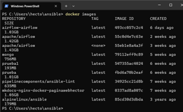
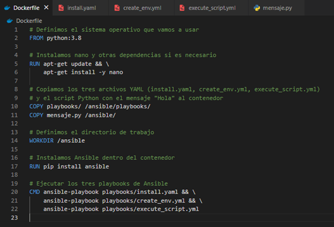
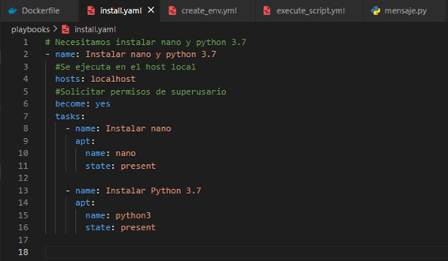
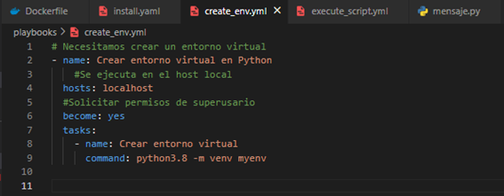
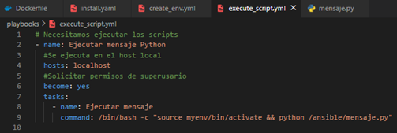
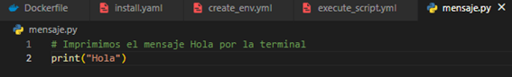
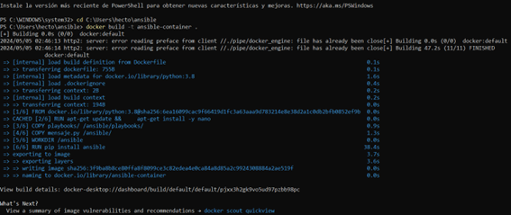
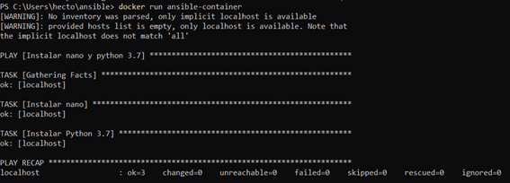
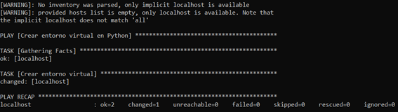
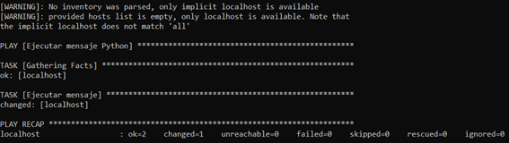

# Ansible

Concepto del proyecto:
 - Se puede hacer en un mismo playbook o en un colección de ellos (ficheros .yml)

**Vamos a hacer 3 ficheros .yml**
1. Primer fichero. yml:
    - Instalar nano
    - Instalar python 3.7 (Se ha tenido que actualizar debido a que Ansible 2.12 requiere como versión mínima para poder funcionar python 8 o más moderna)
2. Segundo fichero .yml:
    - Crear un entorno virtual en python
4. Tercer fichero .yml
    - Ejecutar el .py que imprime “Hola”

Dentro de la Windows PowerShell primero accedemos a la ubicación de donde vamos a trabajar usando el comando de **cd C:\Users\hecto\ansible**.

Debemos tener operativo Docker Desktop para que todo funcione correctamente.

Dentro de terminal ejecutamos el comando **docker images** para mostrar todas las imágenes que tenemos en nuestro ordenador.

 
Creamos una carpeta donde vamos a tener los tres playbooks (3 ficheros .yml)
* Primer fichero. yml:
    - Instalar nano
    - Instalar python 3.7 (Se ha tenido que actualizar debido a que Ansible 2.12 requiere como versión mínima para poder funcionar python 8 o más moderna)
* Segundo fichero .yml:
    - Crear un entorno virtual en python
* Tercer fichero .yml
    - Ejecutar el .py que imprime “Hola”

Usamos el comando **vi Dockerfile** para crear un archivo dockerfile en el contenedor. (En mi caso no funciona otras alternativas son **nano Dockerfile** o usar VSCode)

Dentro de la carpeta que hemos creado para alojar los 3 playbooks, la visualizamos con el comando **ls -l**, y ahora queda crear los tres .yml.

Vamos a empezar a por crear el primero de ellos, donde se debe **instalar nano** y **python 3.8**, todo ello bajo el nombre de **install.yaml**.

El primer comando es **vim install.yml**:

Creamos el segundo de ellos, donde se debe **crear un entorno virtual**, todo ello bajo el nombre de **create_env.yaml**.

El comando es **vim create_env.yml**:

Creamos el segundo de ellos, donde se debe **ejecutar mensaje.py que contiene “Hola”**, todo ello bajo el nombre de **execute_script.yaml**.
El comando es **vim execute_script.yml**:

Donde el código de python que esta ejecutando es:

Para poder ejecutar todo el anterior código debemos realizar el comando para construir el contenedor de Docker **docker build -t ansible-container .**

Después debemos ejecutar el contenedor de Docker para ello ejecutamos el comando **docker run ansible-container**

Se ejecuta correctamente el código encargado de **instalar nano y python 3.7**

 
Se ejecuta correctamente el código encargado de **crear el entorno vitual en Python**

Se ejecuta correctamente el código encargado de **ejecutar el mensaje de “Hola”**

**Video de ayuda:** https://www.youtube.com/watch?v=iuDot25LrOY&t=934s

Hector de la Cruz Baquero - [Linkdedin](https://www.linkedin.com/in/h%C3%A9ctor-de-la-cruz-baquero-ba193429b/) - [Webpage](https://hectorcrzbq.github.io/)
